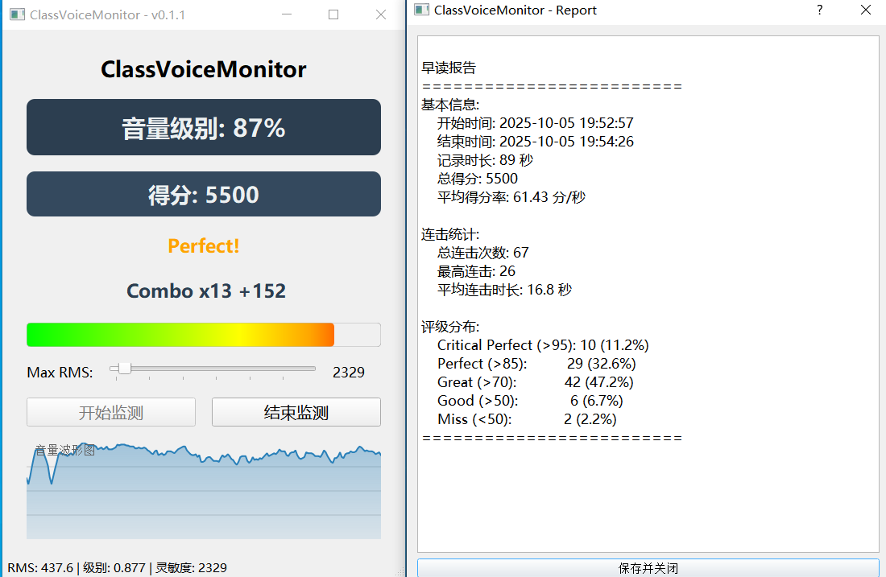

<!--markdownlint-disable MD001 MD033 MD041 MD051-->

# ClassVoiceMonitor

ClassVoiceMonitor 是一款为早读场景设计的的班级大屏辅助工具 
旨在提升班级早读积极性，并提供可读性强的分析报表 
使用 PyQt5 编写，界面极简

## 功能简介

> [!TIP]
>
> 项目处于起步阶段，新增功能可能不及时在此列出，请以 Release 日志为准

### 基础

- [x] 调用设备麦克风，对实时音频进行采样分析
- [x] 通过均方值(RMS)计算音量级别百分比
- [x] 可使用滑块进行灵敏度校准，以适应不同设备
- [x] 响度/时间图像实时绘制，反映一段时间的音量变化
- [x] 生成可读性总结报告并自动保存
- [ ] 对比分析历史数据

### 互动玩法

- [x] 实时评分系统，每秒根据评级进行加分
- [x] 基于音量的五阶评级法: CRITICAL, Perfect, Great, Good, Miss(灵感源于 **maimai** )
- [x] Combo 连击奖励，音量持续5s大于设定值即可触发
- [ ] 成就系统

### 总结报告

- [x] 开始时间/结束时间/持续时间
- [x] 最大 Combo 数/总 Combo 数/平均 Combo 时长
- [x] 各评级数量/占比

## 开始使用
### 首次安装
**首先，请确保您的设备满足以下推荐需求：**

- Windows 系统

> 强烈建议在 Github Releases 下载，仅在它难以连接时选择其它渠道，因为其他渠道往往更新不及时

|      下载渠道      | **🚀 正式版**  |                                       🚧 测试版                                        |
|:--------------:|:---------------------------------------------------------------------------------------------------------------------------------------------------------------------------------------------------:|:---------------------------------------------------------------------------------------:|
| GitHub Release |                                                               [**下载**](https://github.com/Chengzi600/ClassVoiceMonitor/releases/latest)                                                               | 在 [Actions](https://github.com/Chengzi600/ClassVoiceMonitor/actions) 中寻找或自行从`develop`分支构建 |
|      蓝奏云盘      |                                                                                                暂未上传                                                                                                 |                                            -                                            |

下载完成后，将软件压缩包解压，解压时请不要解压到C盘根目录、【下载】文件夹中，否则可能会出现**文件无法读写、文件丢失**等问题

(注: 希沃管家弹窗拦截造成的闪退正在修复中)

运行程序，**Enjoy it** !

> 如您有 Python 环境，可以直接拉取项目，安装依赖（`pip install -r requirements.txt`）并运行`ClassVoiceMonitor.py`，速度更快

### 升级教程
**一般来说，直接将新版本解压，然后将旧版本的配置文件夹复制到解压出来的文件夹内即可** 

若一切正常，程序将提示配置文件更新成功

## 获取帮助

如果您确定遇到的问题是一个 **Bug**，或者要提出一项**新的功能**，请提交 Issue

作者联系方式: **QQ:2752718571**

## 开发

要在本地编译应用，您需要安装以下负载和工具：

- Python 3.9
- 安装依赖（已在`requirements.txt`列出）
- 任意 IDE，如 PyCharm

如果您有意愿做出代码贡献，欢迎提交 Pull Requests，给项目一个 Star

## 许可证

本项目基于 [WTFPL License](LICENSE) 获得许可

## Stars 历史

如果这个项目对您有帮助，请点亮 Star ⭐

